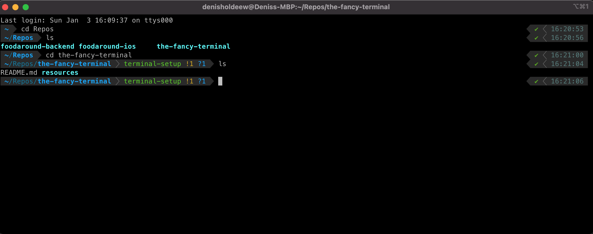
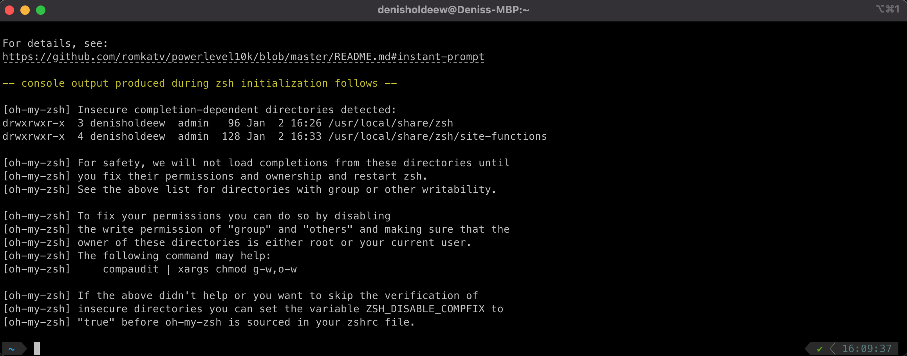

# The Fancy Terminal
This repository is my proposal for a fancy terminal you will like to use. You will have this fancy looking terminal when you finished all steps:  



# Some explanations
Before we start with the configuration, let's clear up some of the terms and tools that are used during this guide.

## Shell
Shell is the programm that processes the commands that you type. The most known shells are [CMD](https://en.wikipedia.org/wiki/Cmd.exe) for Windows and [bash](https://en.wikipedia.org/wiki/Bash_(Unix_shell)) and [zsh](https://en.wikipedia.org/wiki/Z_shell) for Unix systems.

## Terminal
The terminal is a programm that runs a shell. Sometimes you will read the term *terminal emulator*, this is because originally terminals where physical devices (monitor and keyboard) that are nowadays emulated.

## Homebrew
Is a package manager for mac that make it really easy to install software.

## iterm2
iTerm2 is a terminal emulator for macs which brings some nice features making your live within the terminal easier. That is for example an autocomplete function, search and more. You can find detailed descriptions about the terminal alternative on the [iTerm2 homepage](https://iterm2.com/features.html). 

## Oh-My-Zsh
[Oh-My-Zsh](https://github.com/ohmyzsh/ohmyzsh) is a tool that helps you with your *zsh* configuration. It is possible to install plugins with simple commands so you don't have to struggle with complex installations and configurations.


# Setup the terminal manually
## 1. Install homebrew
Check if you have installed homebrew:  
```
which brew
```
This command should return `/usr/local/bin/brew`. If it does not, then use the following command to install homebrew:   
```
/bin/bash -c "$(curl -fsSL https://raw.githubusercontent.com/Homebrew/install/HEAD/install.sh)"
```
## 2. Install iterm2
After installing homebrew run the following command in order to install iterm2
```
brew install --cask iterm2
```
## 3. Install Oh-My-Zsh
Install Oh-My-Zsh with
```
sh -c "$(curl -fsSL https://raw.githubusercontent.com/ohmyzsh/ohmyzsh/master/tools/install.sh)"
```

## 4. Install powerlevel10k theme
This theme has a built in installation wizard that helps you to set up the terminal in a way you like. To install the [powerlevel10k theme](https://github.com/romkatv/powerlevel10k) do the following:

### 4.1. Clone the theme
```
git clone --depth=1 https://github.com/romkatv/powerlevel10k.git ${ZSH_CUSTOM:-$HOME/.oh-my-zsh/custom}/themes/powerlevel10k
```  

### 4.2. Set the theme in the zsh configuration
After the theme is cloned find the `.zshrc` file in your *Home* directory and change `ZSH_THEME="robbyrussell"` to `ZSH_THEME="powerlevel10k/powerlevel10k"`.  

### 4.3. Run the installation wizard
Now you can either restart iTerm, open a new tab or source the `.zshrc` file by running the following command in your home directory: `source .zshrc`.  
The installation wizard should now start and you can easily choose the options you would like. The following is the configuration I use:
1. `Install Meslo Nerd Font?` -> Yes
1. `Prompt Style` -> Classic
1. `Character Set` -> Unicode
1. `Prompt Color` -> Dark
1. `Show current time?` -> 24-hour-format
1. `Prompt Separators` -> Angled
1. `Prompt Heads` -> Sharp
1. `Prompt Tails` -> Flat
1. `Prompt Height` -> One line
1. `Promp Spacing` -> Compact
1. `Icons` -> Few icons
1. `Prompt Flow` -> Concise
1. `Enable Transient Prompt?` -> No
1. `Instant Prompt Mode` -> Verbose 
1. `Apply changes to ~/.zshrc?` -> Yes

### 4.4. Fix potential warnings
It can happen that oh-my-zsh is complaining about some wrongly set permissions on the folders `/usr/local/share/zsh` and `/usr/local/share/zsh/site-functions`:  
  
    
In that case open the `.zshrc` file in your home directory and add `ZSH_DISABLE_COMPFIX=true` **before** `source $ZSH/oh-my-zsh.sh`.  
For more information about that warning have a look at [this github issue](https://github.com/ohmyzsh/ohmyzsh/issues/6835).

Done! Now your terminal is ready to use!

